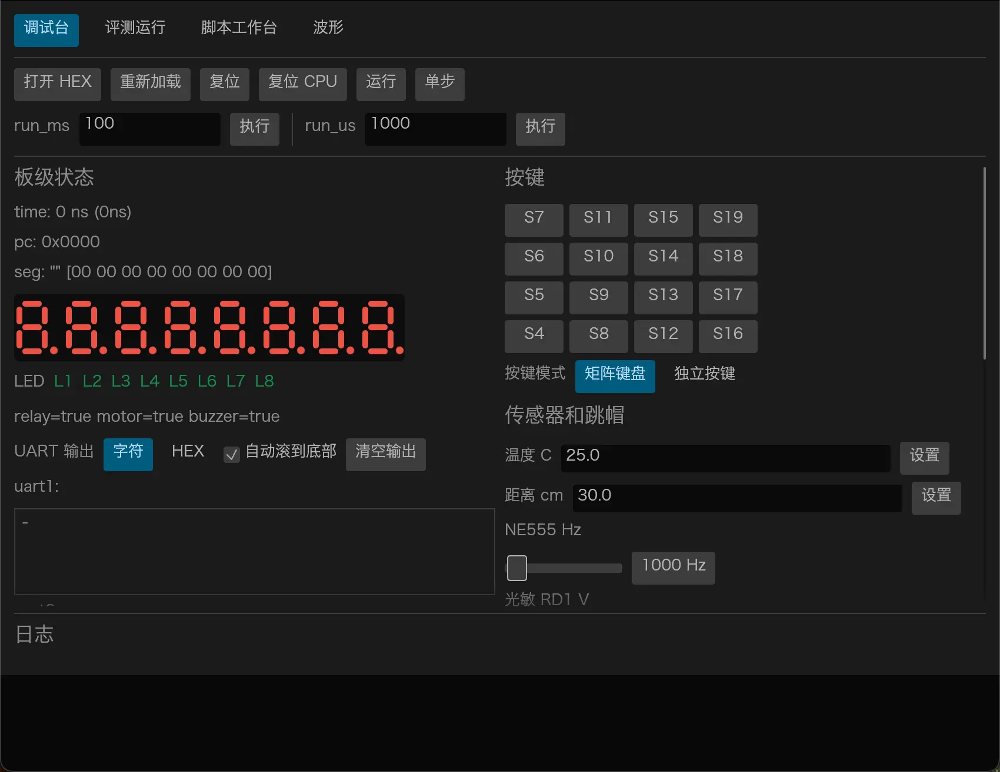
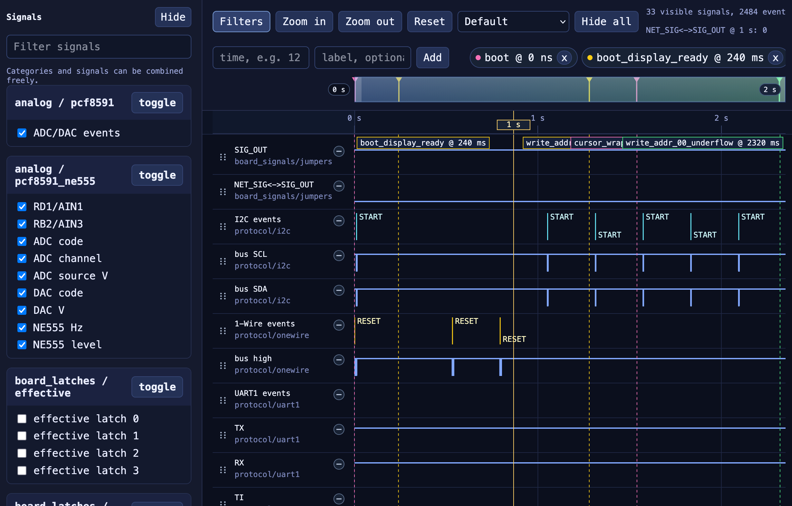

# 蓝桥杯单片机评测

类似 4t 的功能, 能够本地运行 C51 单片机 hex 文件评测.

支持编写评测脚本.

仅针对考纲内容级别的硬件进行模拟仿真, 不对更深层的时序和进行仿真.

## 使用

可执行文件名为 `stcjudge`. 例如执行 `cargo build --release` 之后, 可以直接运行 `target/release/stcjudge`.

当前仓库使用 workspace 结构:

- `crates/core`: `stcjudge` 核心 crate.
- `crates/gui`: `stcjudge-gui` 原生桌面调试台.

> [!note]
> 使用 `--release` 运行会比开发中运行快上不少.

按脚本文件执行:

```bash
stcjudge run --hex samples/key_seg/prj/Objects/key_seg.hex --script samples/key_seg/judge/smoke.rhai
```

从标准输入执行 Rhai:

```bash
stcjudge run --hex samples/key_seg/prj/Objects/key_seg.hex --stdin < samples/key_seg/judge/smoke.rhai
```

交互式执行:

```bash
stcjudge repl --hex samples/key_seg/prj/Objects/key_seg.hex
```

启动 GUI:

```bash
just gui
```

查看 Rhai 脚本逐语句 tracing:

```bash
RUST_LOG=debug stcjudge run --hex samples/key_seg/prj/Objects/key_seg.hex --script samples/key_seg/judge/smoke.rhai
```

固定时刻抓取快照:

```bash
stcjudge dump --hex samples/key_seg/prj/Objects/key_seg.hex --ms 220
```

导出交互式波形:

```bash
stcjudge run --hex samples/led_pwm/prj/Objects/led_pwm.hex --stdin --wave-html /tmp/led_pwm_wave.html <<'EOF'
run_ms(100);
tap_key(S9, 80);
run_ms(100);
EOF
```

运行 criterion 仿真基准:

```bash
just bench
```

或直接执行:

```bash
cargo bench --bench sim
```

## GUI

`stcjudge-gui` 是面向本地调试和评测的原生桌面界面, 可以直接加载 HEX, 查看板级状态, 注入按键和串口输入, 运行 Rhai 评测脚本, 并导出波形文件. 波形查看界面是独立 HTML, 导出后在浏览器中打开.

<table>
  <tr>
    <td width="50%" valign="top"></td>
    <td width="50%" valign="top"></td>
  </tr>
</table>

## 发布

Release workflow 只会在手动触发或推送 `v*` tag 时运行, 普通 `git push origin main` 不会发布任何 release.

正式 release:

```bash
git tag v0.1.0
git push origin v0.1.0
```

预发布:

```bash
git tag v0.1.0-pre
git push origin v0.1.0-pre
```

手动触发可以在 GitHub Actions 的 `Release` workflow 中选择 `release_type`:

- `release`: 发布 `v<version>` 正式 release, 并标记为 latest.
- `prerelease`: 发布 `v<version>-pre` prerelease, 不标记为 latest.
- `auto`: 如果 `ref` 是 tag, 按 tag 名判断发布类型, 否则默认发布 prerelease.

tag 中的版本号需要和 Cargo workspace version 一致, 例如 `v0.1.0` 对应 `version = "0.1.0"`.

## 作为库复用

除了 `stcjudge` CLI, 当前仓库也可以作为库被其他 crate 直接依赖.

- `Simulator`: 仿真器核心入口.
- `RunToTarget`, `RunToEdge`: 相位对齐和信号等待.
- `WaveCaptureOptions`: 波形采集配置.
- `Ds1302State`, `UartConfig`: 常见外设状态和串口配置.
- `BenchHarness`: 面向单功能 bench 的轻量包装.

这意味着后续独立 GUI crate 可以直接调用仿真核心 API, 不需要通过启动 `stcjudge` CLI 的方式间接实现功能.

当前的 criterion 基准不依赖 samples 目录下的 HEX 文件, 而是使用内建的稳定代码镜像, 并按单个功能拆分为执行, 输入注入, 状态读取, wave 导出等微基准, 便于长期跟踪性能变化.

## 评测脚本

- 评测脚本约定放在 `samples/xxx/judge/`.
- 详细手册见 [docs/judge-script-manual.md](docs/judge-script-manual.md).
- 波形导出说明见 [docs/wave-export.md](docs/wave-export.md).
- 芯片与中断仿真说明见 [docs/chip.md](docs/chip.md).
- C51 CLI 编译说明见 [docs/c51-cli-build.md](docs/c51-cli-build.md).
- `just build-sample <sample>` 会自动读取项目根目录 `.env`, 然后调用现有 `uvproj` 工程做批量构建. Windows 直接调用 `UV4.exe`, macOS 通过 CrossOver 调用同一套工程. Linux 暂不支持.
- `bash scripts/keil-env-doctor.sh <sample>` 和 `just keil-doctor` 可检查 macOS 兼容层中的 Keil 和 STC15 器件资源是否齐全.
- 现在支持 `print(...)`, `watch_led_stats(...)`, `display_text(window_ms)`, `display_number(...)`, `key_mode(...)`, `jumper_on(...)`, `jumper_off(...)`, `jumper_installed(...)` 以及内置常量 `L1..L8`, `S4..S19`, `RB2/RB3/RB4/RD1`, `KEYBOARD/KBD`, `BUTTON/BTN`, `SIG_OUT/NET_SIG`.
- `RUST_LOG=debug` 时会输出 Rhai 脚本逐语句执行进度, 包括步号, 行列号, 调用层级和当前源码行.
- 默认跳帽状态按原理图建模, `NET_SIG` 不会自动连到 `SIG_OUT`. 如果题目需要把 NE555 输出送到 `P3.4/T0`, 需要在脚本里显式写 `jumper_on(NET_SIG, SIG_OUT)`.

## 仿真时钟

- 当前 CPU 基准按 STC15F2K60S2 的 1T 模式和 12MHz 主时钟建模.
- `run_ms` 和 `run_us` 只推进虚拟时间, 不等待真实时间, 所以评测速度不受 wall clock 限制.
- 和真机相比, 如果题目依赖外部晶振配置、时钟分频、模拟器件建立时间或未实现的片上外设细节, 结果仍可能有偏差.

## 模块

- `ds1302`, `pcf8591`, `at24c02`, `ne555`, `seg`, `超声波`, `按键` 已经拆成独立 Rust 模块.
- 当前可以直接在脚本中读取 `relay_on()`, `buzzer_on()`, `motor_on()` 三类板载输出状态.

## docs

- SCH_V31.pdf: 开发板原理图.
- STC15_DS.pdf: STC15 系列芯片的用户手册.
- knowledge-points.pdf: 十五届单片机考纲.
- chip.md: 芯片与中断仿真相关说明.
- Datasheet: 板上各个外设的用户手册.

## samples

评测真题示例.
