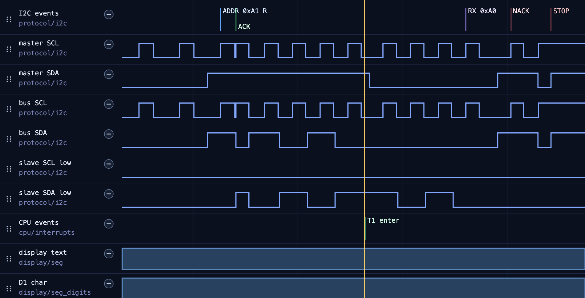

# EEPROM READ WRITE

仅仅在 0 地址发出 EEPROM WRITE 和 READ 信号, 并且添加一个可能的 Timer1 控制 P2 P0, 模拟干扰.

## 中断干扰 eeprom 读取情况

如果在 IIC 读取的时候不加中断屏蔽, 那么就可能导致 P2 P0 latch 写入的时候拉低.



中断在 IIC 读取的时候强行插入, `P2 = P2 & 0x1f | 0x80; P2 &= 0x1f;` 这一步读取了拉低的 P20, 并且置位 P20 为 0, 导致 iic bus 被拉低, 无法读取到正确的数值.

---

在我的这个代码当中, 使用在读 sda 之前将 `sda = 1` 释放, 减少中断将 sda 置 0 的情况.

```c
unsigned char I2CReceiveByte(void)
{
    unsigned char da;
    unsigned char i;
    for(i=0;i<8;i++){   
        scl = 1;
        I2C_Delay(DELAY_TIME);
        da <<= 1;
        sda = 1; // avoid isr, 就是这行
        if(sda) 
            da |= 0x01;
        scl = 0;
        I2C_Delay(DELAY_TIME);
    }
    return da;    
}
```

当然实机情况下出错的可能性比较低, 不知道为什么.
